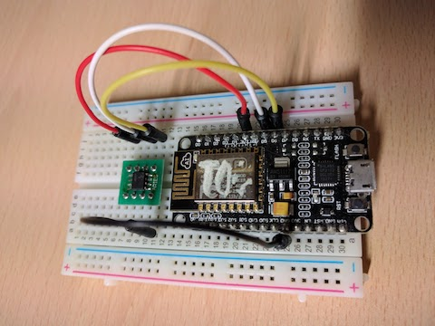

<link href="https://fonts.googleapis.com/icon?family=Material+Icons" rel="stylesheet">

# Secure IoT devices with ATECC508A

This is a step-by-step instruction to implement securely store and communication with aws-iot (mqtt) for ESP8266 and Microchip's ATECC508A chip. 

We also develop a shield pcb board to easely connect ATECC508A with ESP8266 / ESP32 NodeMCU form factor and as in the Cesanta post[1], this combo is very inexpensive: the ATECC508A is less than $1, and ESP8266 is less than $2.

> Figure 1: Wiring for the bare-bones ATECC508A[1]

The ATECC508A crypto element[3] is the first crypto device to integrate ECDH (Elliptic Curve Diffie–Hellman) key agreement, which makes it easy to add confidentiality (encryption/decryption) to digital systems including Internet of Things (IoT) nodes used in home automation, industrial networking, accessory and consumable authentication, medical, mobile and other applications. In addition to ECDH, the ATECC508A has ECDSA sign-verify capabilities built-in to provide highly secure asymmetric authentication. 

As we see the application of IoT technologies evolve, it is gratifying to witness the fact that security has become an intrinsic part of the implementation debate. Whilst there are plenty of hacks and vulnerabilities that are still capturing media attention, we have made significant ground in recent times with industry and government fighting back. Across the globe there have been healthy discussions around certification and regulatory controls in cyber security where IoT features prominently.[7]

Our goal it's make it simple enough to make part of every project you'll develop, and we hope, in the near feature, it's embebed with the microprocessor board.

# Roadmap

Activity | Status | Dead line
---| --- | ---
1. Prototyping | <i class='material-icons'>done</i> | Dec-2017
2. PCB design | <i class='material-icons'>build</i> | Set-2018
3. Software development | <i class='material-icons'>calendar_today</i> | TBD
4. Manufacturing | <i class='material-icons'>calendar_today</i> | TBD
5. Unit tests (Eletrical and software) | <i class='material-icons'>calendar_today</i> | TBD
6. Performance tests | <i class='material-icons'>calendar_today</i> | TBD
7. Field tests | <i class='material-icons'>calendar_today</i> | TBD
8. Initial release | <i class='material-icons'>calendar_today</i> | TBD

> <i class='material-icons'>calendar_today</i><i class='material-icons'>arrow_right</i><i class='material-icons'>build</i><i class='material-icons'>arrow_right</i><i class='material-icons'>done</i>

# References

1. [The two-dollar secure IoT solution: Mongoose OS + ESP8266 + ATECC508 + AWS IoT](https://mongoose-os.com/blog/mongoose-esp8266-atecc508-aws/)
2. [Simple device control using MQTT](https://github.com/cesanta/mongoose-os/tree/master/fw/examples/c_mqtt)
3. [Mongoose OS - IoT Firmware Development Framework](https://mongoose-os.com/)
4. [ATECC508A](https://www.microchip.com/wwwproducts/en/ATECC508A)
5. [AWS architect features Mongoose OS on ESP8266 and ECC508A at re:Invent 2016](https://www.youtube.com/watch?v=fwr6oSEZpwQ)
6. [IoT Security Foundation](https://www.iotsecurityfoundation.org/)
7. [Security By Choice](https://www.iotsecurityfoundation.org/security-by-choice/)